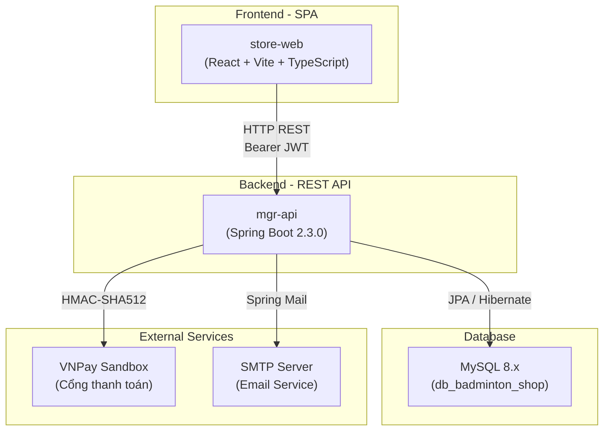
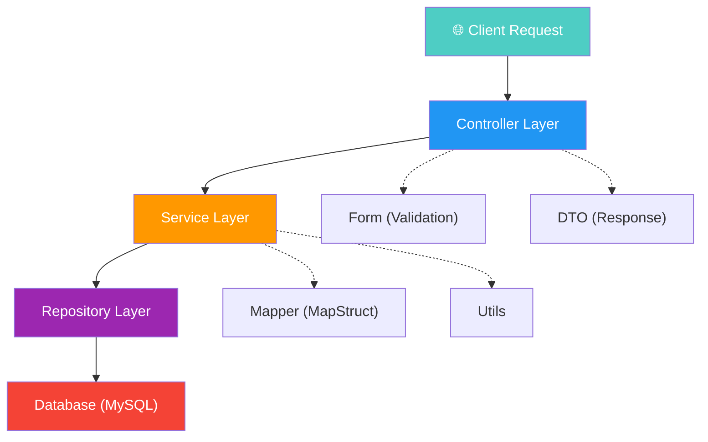
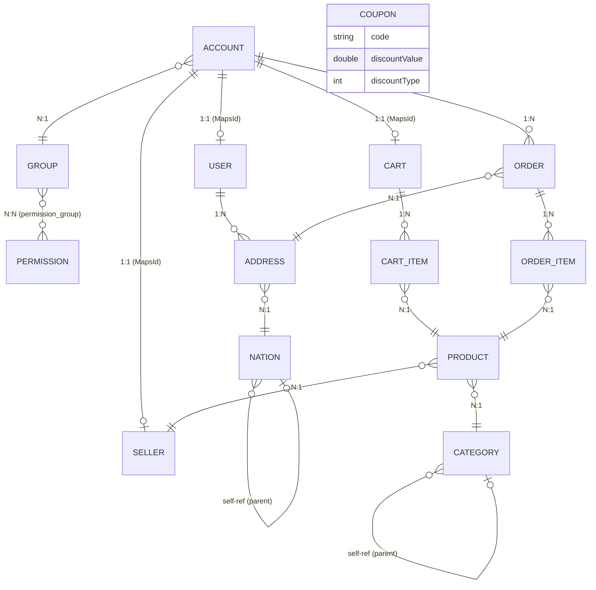
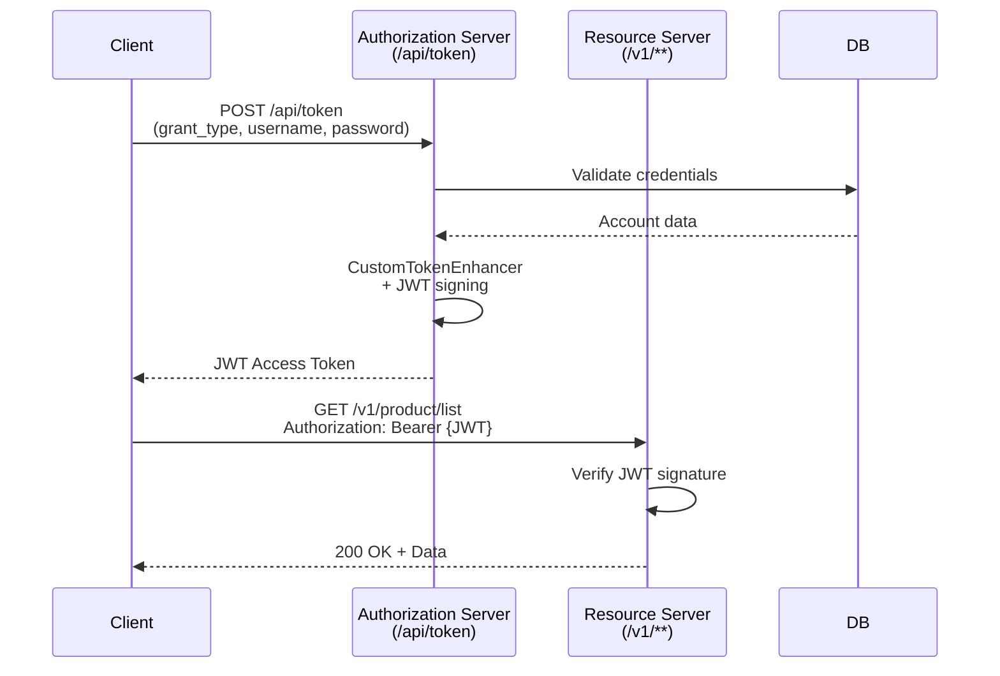
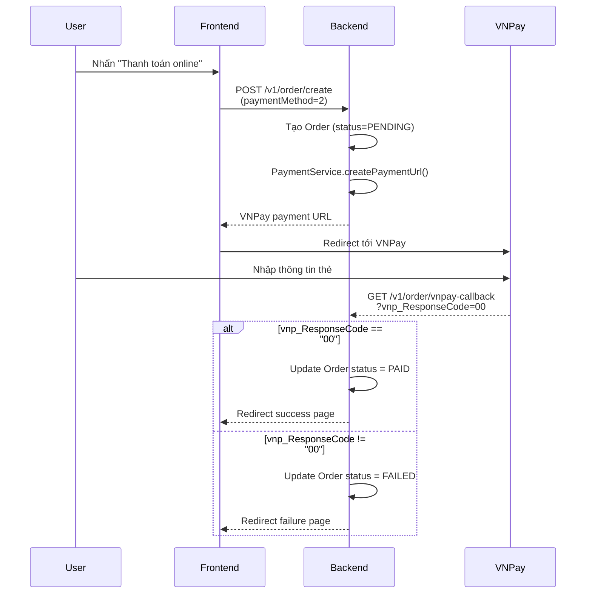
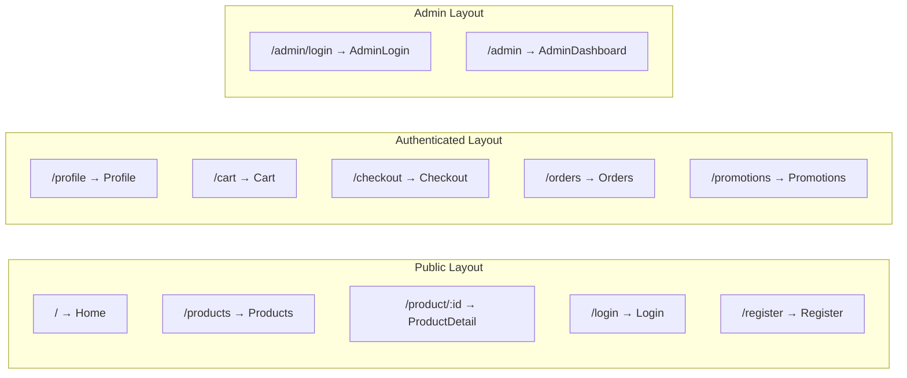
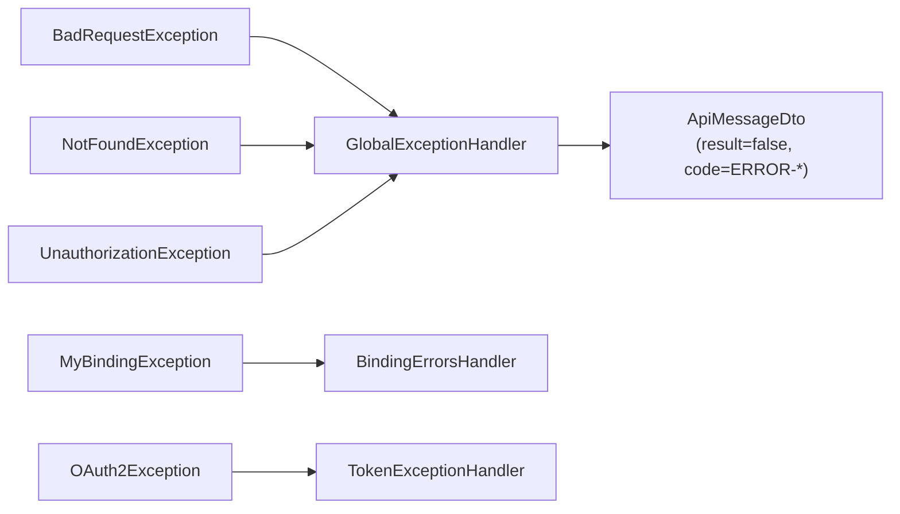
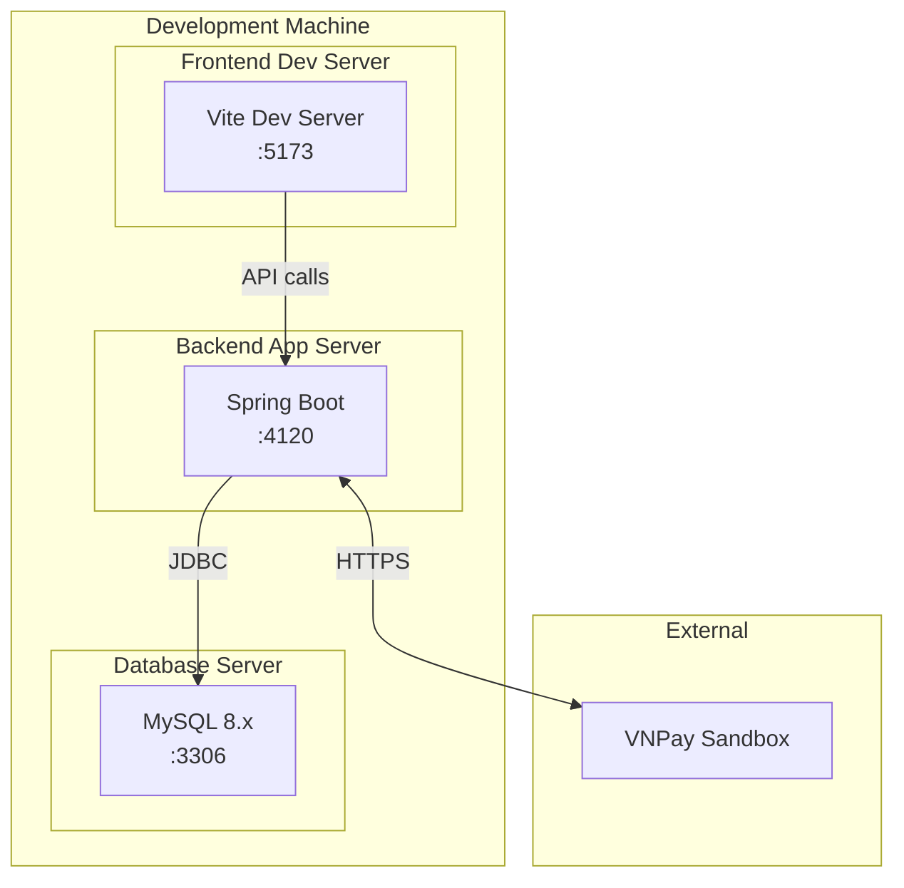

# 🏸 Badminton Shop — Kiến Trúc Dự Án Chi Tiết

> Tài liệu mô tả toàn bộ kiến trúc hệ thống ứng dụng thương mại điện tử bán dụng cụ cầu lông  
> **Version**: 1.0.0 · **Ngày cập nhật**: 09/04/2026

---

## 1. Tổng Quan Hệ Thống

Badminton Shop là một ứng dụng **full-stack e-commerce** chuyên bán dụng cụ cầu lông. Hệ thống được xây dựng theo kiến trúc **Client-Server**, tách biệt frontend (SPA) và backend (REST API).



| Thành phần | Công nghệ | Port |
|---|---|---|
| **Frontend** | React 19, Vite 8, TailwindCSS 4, TypeScript 6 | `5173` |
| **Backend** | Spring Boot 2.3.0, Java 11 | `4120` |
| **Database** | MySQL 8.x | `3306` |
| **Thanh toán** | VNPay Sandbox API | — |

---

## 2. Kiến Trúc Backend (Spring Boot)

### 2.1. Cấu Trúc Thư Mục

```
src/main/java/com/mgr/api/
├── ManagementApplication.java      ← Entry point
├── component/                      ← Spring Components (Auditor, Interceptor)
│   ├── AuditorAwareImpl.java
│   └── LogInterceptor.java
├── config/                         ← Cấu hình hệ thống (17 files)
│   ├── AuthorizationServerConfig   ← OAuth2 Authorization Server
│   ├── ResourceServerConfig        ← OAuth2 Resource Server
│   ├── SecurityConfig              ← Spring Security
│   ├── CustomTokenEnhancer         ← JWT Token Enhancer
│   ├── CustomTokenGranter          ← Custom Grant Types
│   ├── VNPayConfig                 ← HMAC-SHA512 cho VNPay
│   ├── SwaggerConfig               ← API Documentation
│   ├── SimpleCorsFilter            ← CORS Filter
│   ├── ThreadConfig                ← Async Thread Pool
│   └── WebMvcConfig                ← MVC Configuration
├── constant/                       ← Hằng số hệ thống
│   └── MgrConstant.java
├── controller/                     ← REST Controllers (14 files)
├── dto/                            ← Data Transfer Objects
├── exception/                      ← Exception Handling
├── form/                           ← Request Form/Validation
├── jwt/                            ← JWT Utilities
│   └── MgrJwt.java
├── mapper/                         ← MapStruct Mappers (12 files)
├── model/                          ← JPA Entities (17 files)
│   └── criteria/                   ← Dynamic Query Criteria (10 files)
├── repository/                     ← Spring Data JPA Repositories
├── service/                        ← Business Logic Layer
│   ├── impl/                       ← Service Implementations
│   ├── id/                         ← Snowflake ID Generator
│   └── schedule/                   ← Scheduled Tasks
├── utils/                          ← Utility Classes
└── validation/                     ← Custom Validators
```

### 2.2. Kiến Trúc Phân Tầng (Layered Architecture)



| Tầng | Vai trò | Ghi chú |
|---|---|---|
| **Controller** | Nhận request, validate, trả response | Kế thừa `ABasicController` |
| **Service** | Chứa business logic | Interface + Impl pattern |
| **Repository** | Truy vấn database | Spring Data JPA |
| **Model/Entity** | Ánh xạ bảng DB | Kế thừa `Auditable<String>` |
| **DTO** | Object truyền dữ liệu ra ngoài | Tách rời entity |
| **Form** | Object nhận dữ liệu đầu vào | Kèm validation |
| **Mapper** | Chuyển đổi Entity ↔ DTO/Form | MapStruct 1.3.1 |
| **Criteria** | Dynamic query filter | JPA Specification pattern |

---

## 3. Mô Hình Dữ Liệu (Entity Relationship)

### 3.1. Sơ Đồ Quan Hệ



### 3.2. Chi Tiết Entities

Tất cả entity đều kế thừa `Auditable<String>` → có sẵn các trường audit:

| Trường | Kiểu | Mô tả |
|---|---|---|
| `id` | `Long` | Primary Key, sinh bởi **Snowflake ID Generator** |
| `createdBy` | `String` | Người tạo (auto audit) |
| `createdDate` | `LocalDateTime` | Thời gian tạo |
| `modifiedBy` | `String` | Người sửa cuối |
| `modifiedDate` | `LocalDateTime` | Thời gian sửa cuối |
| `status` | `int` | Trạng thái (1=Active, 0=Pending, -1=Lock, -2=Delete) |

> [!NOTE]
> Table prefix: tất cả tên bảng đều có prefix `db_mgr_` (ví dụ: `db_mgr_product`, `db_mgr_account`)

#### Các Entity chính:

````carousel
**Account** — Tài khoản hệ thống
```
- kind: int (1=Admin, 2=User, 3=Seller)
- username, phone, email, password
- fullName, avatarPath
- group → Group (N:1)
- lastLogin, resetPwdCode, resetPwdTime
- attemptCode, attemptLogin
- isSuperAdmin: Boolean
```
<!-- slide -->
**User** — Hồ sơ người mua
```
- account → Account (1:1, MapsId)
- gender: int (1=Male, 2=Female, 3=Other)
- dateOfBirth: LocalDate
- addresses → List<Address> (1:N)
```
<!-- slide -->
**Seller** — Hồ sơ người bán
```
- account → Account (1:1, MapsId)
- shopName, shopDescription
- address → Address (1:1)
```
<!-- slide -->
**Product** — Sản phẩm cầu lông
```
- name, description(TEXT), price, stock
- imagePath, brand, size, color
- category → Category (N:1)
- seller → Seller (N:1)
```
<!-- slide -->
**Order** — Đơn hàng
```
- account → Account (N:1)
- totalPrice: Double
- paymentMethod: int (1=COD, 2=VNPay)
- address → Address (N:1)
- items → List<OrderItem> (1:N, cascade)
```
<!-- slide -->
**Coupon** — Mã giảm giá
```
- code: String (unique)
- discountValue: Double
- discountType: int (1=Percent, 2=Fixed)
- expiryDate: LocalDateTime
- minOrderValue: Double
```
````

---

## 4. Hệ Thống Bảo Mật (Security Architecture)

### 4.1. Tổng Quan OAuth2 + JWT



### 4.2. Custom Grant Types

Hệ thống hỗ trợ **4 loại grant_type** thông qua `CustomTokenGranter`:

| Grant Type | Mô tả | Kind |
|---|---|---|
| `password` | Standard OAuth2 | — |
| `custom` | Đăng nhập Admin | `USER_KIND_ADMIN (1)` |
| `user` | Đăng nhập User (Buyer) | `USER_KIND_USER (2)` |
| `seller` | Đăng nhập Seller | `USER_KIND_SELLER (3)` |

### 4.3. Public vs Protected Endpoints

```
📂 PUBLIC (không cần token):
   /api/token                          ← Lấy JWT token
   /v1/account/request-forget-password ← Quên mật khẩu
   /v1/account/forget-password
   /v1/account/verify-credential
   /v1/user/register                   ← Đăng ký tài khoản
   /v1/product/list                    ← Danh sách sản phẩm
   /v1/product/get/**                  ← Chi tiết sản phẩm
   /v1/category/list                   ← Danh sách danh mục
   /api/payment/**                     ← VNPay callback
   /swagger-ui.html                    ← API docs

🔒 PROTECTED (cần Bearer JWT):
   /v1/cart/**                         ← Quản lý giỏ hàng
   /v1/order/**                        ← Quản lý đơn hàng
   /v1/user/**                         ← Hồ sơ cá nhân
   /v1/address/**                      ← Quản lý địa chỉ
   /v1/account/**                      ← Quản lý tài khoản (Admin)
   /v1/group/**                        ← Quản lý nhóm (Admin)
   /v1/permission/**                   ← Quản lý quyền (Admin)
   /v1/seller/**                       ← Quản lý shop (Seller)
```

### 4.4. Token Storage

- **TokenStore**: `JdbcTokenStore` — lưu token vào MySQL
- **JWT Signing Key**: cấu hình qua `signing.key` property
- **Token Enhancer Chain**: `CustomTokenEnhancer` → `JwtAccessTokenConverter`

---

## 5. REST API Controllers

### 5.1. Danh Sách Controllers

| Controller | Endpoint Prefix | Mô tả |
|---|---|---|
| [AccountController](file:///d:/PET_PROJECT/badminton_shop/source/mgr-api/src/main/java/com/mgr/api/controller/AccountController.java) | `/v1/account` | CRUD Account, Login, Forget Password |
| [UserController](file:///d:/PET_PROJECT/badminton_shop/source/mgr-api/src/main/java/com/mgr/api/controller/UserController.java) | `/v1/user` | Đăng ký, Hồ sơ User, CRUD |
| [ProductController](file:///d:/PET_PROJECT/badminton_shop/source/mgr-api/src/main/java/com/mgr/api/controller/ProductController.java) | `/v1/product` | CRUD Product, Tìm kiếm |
| [CategoryController](file:///d:/PET_PROJECT/badminton_shop/source/mgr-api/src/main/java/com/mgr/api/controller/CategoryController.java) | `/v1/category` | CRUD Category |
| [CartController](file:///d:/PET_PROJECT/badminton_shop/source/mgr-api/src/main/java/com/mgr/api/controller/CartController.java) | `/v1/cart` | Add/Remove/Update Cart |
| [OrderController](file:///d:/PET_PROJECT/badminton_shop/source/mgr-api/src/main/java/com/mgr/api/controller/OrderController.java) | `/v1/order` | Đặt hàng, VNPay callback |
| [PaymentController](file:///d:/PET_PROJECT/badminton_shop/source/mgr-api/src/main/java/com/mgr/api/controller/PaymentController.java) | `/api/payment` | VNPay Payment URL |
| [SellerController](file:///d:/PET_PROJECT/badminton_shop/source/mgr-api/src/main/java/com/mgr/api/controller/SellerController.java) | `/v1/seller` | CRUD Seller |
| [AddressController](file:///d:/PET_PROJECT/badminton_shop/source/mgr-api/src/main/java/com/mgr/api/controller/AddressController.java) | `/v1/address` | CRUD Address |
| [NationController](file:///d:/PET_PROJECT/badminton_shop/source/mgr-api/src/main/java/com/mgr/api/controller/NationController.java) | `/v1/nation` | Tỉnh/Huyện/Xã |
| [CouponController](file:///d:/PET_PROJECT/badminton_shop/source/mgr-api/src/main/java/com/mgr/api/controller/CouponController.java) | `/v1/coupon` | CRUD Coupon |
| [GroupController](file:///d:/PET_PROJECT/badminton_shop/source/mgr-api/src/main/java/com/mgr/api/controller/GroupController.java) | `/v1/group` | CRUD Role Group |
| [PermissionController](file:///d:/PET_PROJECT/badminton_shop/source/mgr-api/src/main/java/com/mgr/api/controller/PermissionController.java) | `/v1/permission` | CRUD Permission |

### 5.2. Response Format

Tất cả API đều trả về format thống nhất:

```json
{
  "result": true,
  "data": { ... },
  "message": "Success",
  "code": null
}
```

Khi lỗi:
```json
{
  "result": false,
  "data": null,
  "message": "Error message",
  "code": "ERROR-ACCOUNT-0000"
}
```

---

## 6. Tích Hợp VNPay (Payment Gateway)



| Config | Giá trị |
|---|---|
| `vnp_TmnCode` | `ZH2N3LT4` |
| `vnp_PayUrl` | `https://sandbox.vnpayment.vn/paymentv2/vpcpay.html` |
| `vnp_ReturnUrl` | `http://localhost:4120/v1/order/vnpay-callback` |
| **Hash Algorithm** | HMAC-SHA512 |

---

## 7. Kiến Trúc Frontend (React SPA)

### 7.1. Tech Stack

| Công nghệ | Version | Vai trò |
|---|---|---|
| React | 19.2 | UI Library |
| TypeScript | 6.0 | Type Safety |
| Vite | 8.0 | Build Tool / Dev Server |
| TailwindCSS | 4.2 | Utility-first CSS |
| React Router DOM | 7.14 | Client-side Routing |
| Axios | 1.15 | HTTP Client |
| Lucide React | 1.8 | Icon Library |

### 7.2. Cấu Trúc Thư Mục

```
store-web/src/
├── main.tsx                     ← Entry point
├── App.tsx                      ← Router configuration
├── App.css                      ← Global styles
├── index.css                    ← TailwindCSS imports
├── api/
│   └── axios.ts                 ← Axios instance + JWT interceptor
├── assets/                      ← Static assets
├── components/
│   └── layout/
│       ├── Layout.tsx           ← Main layout wrapper
│       └── Navbar.tsx           ← Navigation bar
├── layouts/
│   └── AdminLayout.tsx          ← Admin panel layout
└── pages/
    ├── Home.tsx                 ← Trang chủ
    ├── Products.tsx             ← Danh sách sản phẩm
    ├── ProductDetail.tsx        ← Chi tiết sản phẩm
    ├── Cart.tsx                 ← Giỏ hàng
    ├── Checkout.tsx             ← Thanh toán
    ├── Orders.tsx               ← Lịch sử đơn hàng
    ├── Profile.tsx              ← Hồ sơ cá nhân
    ├── Login.tsx                ← Đăng nhập
    ├── Register.tsx             ← Đăng ký
    ├── Promotions.tsx           ← Khuyến mãi
    └── admin/
        ├── AdminLogin.tsx       ← Đăng nhập Admin/Seller
        └── AdminDashboard.tsx   ← Bảng điều khiển Admin
```

### 7.3. Routing Map



| Route | Page | Layout | Auth |
|---|---|---|---|
| `/` | Home | Layout (Navbar) | ❌ |
| `/products` | Products | Layout (Navbar) | ❌ |
| `/product/:id` | ProductDetail | Standalone | ❌ |
| `/login` | Login | Standalone | ❌ |
| `/register` | Register | Standalone | ❌ |
| `/profile` | Profile | Layout (Navbar) | ✅ |
| `/cart` | Cart | Layout (Navbar) | ✅ |
| `/checkout` | Checkout | Layout (Navbar) | ✅ |
| `/orders` | Orders | Layout (Navbar) | ✅ |
| `/promotions` | Promotions | Layout (Navbar) | ❌ |
| `/admin/login` | AdminLogin | Standalone | ❌ |
| `/admin` | AdminDashboard | AdminLayout | ✅ |

### 7.4. API Client (Axios)

```typescript
// Base URL: http://localhost:4120
// Interceptor: Tự động gắn Bearer token từ localStorage
//   - Ưu tiên 'token' (user) hoặc 'admin_token' (admin/seller)
//   - Không ghi đè nếu header Authorization đã có sẵn
```

---

## 8. Các Thư Viện & Dependencies Quan Trọng

### 8.1. Backend Dependencies

| Library | Version | Vai trò |
|---|---|---|
| Spring Boot | 2.3.0 | Application Framework |
| Spring Security OAuth2 | 2.3.3 | Authentication & Authorization |
| Spring Security JWT | 1.0.9 | JWT Token handling |
| Spring Data JPA | — | ORM & Repository |
| Hibernate | 5.6.14 | JPA Implementation |
| Liquibase | 4.19.0 | Database Migration |
| MapStruct | 1.3.1 | Object Mapping |
| Lombok | 1.18.12 | Boilerplate Reduction |
| ModelMapper | 2.3.8 | Object Mapping (fallback) |
| Springfox Swagger | 2.9.2 | API Documentation |
| Apache POI | 5.2.5 | Excel Import/Export |
| Apache Commons CSV | 1.8 | CSV Processing |
| OpenFeign | 2.2.9 | HTTP Client (inter-service) |
| Lettuce | 5.2.1 | Redis Client |
| TOTP | 1.7.1 | Two-Factor Auth |
| Log4j2 | — | Logging Framework |
| Spring Boot Admin Client | 2.2.2 | Monitoring |

### 8.2. Frontend Dependencies

| Library | Version | Vai trò |
|---|---|---|
| React | 19.2 | UI Library |
| React Router DOM | 7.14 | Routing |
| Axios | 1.15 | HTTP Client |
| TailwindCSS | 4.2 | CSS Framework |
| Lucide React | 1.8 | Icons |
| clsx + tailwind-merge | — | Class utilities |

---

## 9. Cơ Chế Đặc Biệt

### 9.1. Snowflake ID Generator

Hệ thống sử dụng **Snowflake ID** thay vì auto-increment để sinh primary key, đảm bảo:
- Unique trên distributed systems
- Tăng dần theo thời gian (sortable)
- Không cần round-trip DB

> [!IMPORTANT]
> Tất cả entity đều dùng `@GenericGenerator(strategy = "com.mgr.api.service.id.IdGenerator")` — ID được sinh ở application layer.

### 9.2. JPA Auditing

Tự động ghi nhận `createdBy`, `createdDate`, `modifiedBy`, `modifiedDate` thông qua:
- `@EnableJpaAuditing` trên Application class
- `AuditorAwareImpl` lấy username từ Security Context

### 9.3. Dynamic Query với Criteria

Mỗi entity có một `*Criteria` class tương ứng, hỗ trợ filter động:
- `ProductCriteria` — lọc theo name, brand, category, price range...
- `AccountCriteria` — lọc theo username, email, kind, status...
- `OrderCriteria` — lọc theo status, payment method...

### 9.4. Mapper Pattern (MapStruct)

12 mapper classes chuyển đổi giữa Entity ↔ DTO ↔ Form:

```
AccountMapper, UserMapper, SellerMapper, ProductMapper,
CategoryMapper, CartMapper, OrderMapper, CouponMapper,
AddressMapper, NationMapper, GroupMapper, PermissionMapper
```

### 9.5. Error Handling



Sử dụng mã lỗi có cấu trúc: `ERROR-{DOMAIN}-{NUMBER}`
- `ERROR-ACCOUNT-0000` → Account not found
- `ERROR-PRODUCT-0001` → Product not found
- `ERROR-FORM-0001` → Invalid form

---

## 10. Database & Migration

### 10.1. Cấu Hình Database

| Property | Value |
|---|---|
| **DBMS** | MySQL 8.x |
| **Database** | `db_badminton_shop` |
| **URL** | `jdbc:mysql://localhost:3306/db_badminton_shop` |
| **DDL Strategy** | `none` (Liquibase quản lý) |
| **Timezone** | UTC |

### 10.2. Liquibase Migration

```
src/main/resources/liquibase/
├── db.changelog-master.xml      ← Master changelog
└── dev/                         ← Dev profile changesets
```

- Tất cả schema changes được quản lý qua Liquibase XML changesets
- Liquibase diff tự động so sánh Hibernate entities với DB thực tế
- Profile `dev` là mặc định

### 10.3. Sample Data

File [import_sample_data.sql](file:///d:/PET_PROJECT/badminton_shop/source/mgr-api/src/main/resources/import_sample_data.sql) chứa dữ liệu mẫu:
- 5 Categories, 30 Products, 5 Sellers, 5 Admins, 5 Nations

---

## 11. Cấu Hình Bổ Sung

### 11.1. Logging

| Property | Value |
|---|---|
| Framework | Log4j2 (thay thế Logback) |
| Root Level | `WARN` |
| App Level | `DEBUG` |
| Log File | `logs/mgr-api.log` |

### 11.2. Async Processing

| Property | Value |
|---|---|
| Thread Pool Size | 10 |
| Queue Size | 150 |
| Enabled via | `@EnableAsync` |

### 11.3. CORS

`SimpleCorsFilter` cho phép cross-origin requests từ frontend (port 5173) đến backend (port 4120).

### 11.4. API Documentation

Swagger UI khả dụng tại: `http://localhost:4120/swagger-ui.html`

---

## 12. Sơ Đồ Triển Khai (Deployment)



> [!TIP]
> **Chạy dự án**:
> - Backend: `mvn spring-boot:run` (port 4120)
> - Frontend: `cd store-web && npm run dev` (port 5173)
> - Database: MySQL phải chạy sẵn tại port 3306

---

## 13. Tóm Tắt

| Khía cạnh | Chi tiết |
|---|---|
| **Kiến trúc** | Monolithic (Backend) + SPA (Frontend) |
| **Authentication** | OAuth2 + JWT, Custom Grant Types |
| **Authorization** | Group-Permission RBAC |
| **Database** | MySQL + Liquibase Migration |
| **ID Strategy** | Snowflake ID Generator |
| **Mapping** | MapStruct (Entity ↔ DTO ↔ Form) |
| **Payment** | VNPay (COD + Online) |
| **API Docs** | Swagger 2.9.2 |
| **Frontend** | React 19 + Vite + TailwindCSS + TypeScript |
| **Logging** | Log4j2 |
| **Monitoring** | Spring Boot Admin Client + Actuator |
